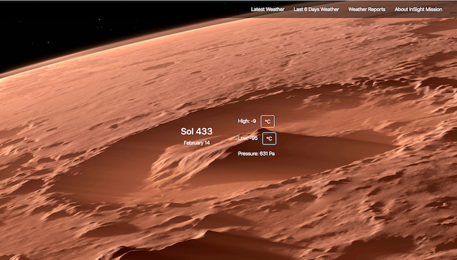

# Mars Weather App

An app displaying the latest weather reports on Mars. It also includes some information about NASA's InSight mission.

This app was made by Geckos Team 4 for the Chingu Collabs Voyage 15.

## Demo

Live version: [https://chingu-voyages.github.io/v15-geckos-team-04/](https://chingu-voyages.github.io/v15-geckos-team-04/)

## Features

- Main section shows the latest temperature and pressure measeruments on Mars
- Table displaying maximum and minimum temperature from last six days
- Reports section shows table with last seven deays weather measurement and two charts displaying maximum and minimum temperature fluctuations
- Temperature scale changes from Fahrenheit to Celsius and back upon clicking the temperature button
- Section that gathers some general information about NASA's InSight mission

## Installing
In order to run this project locally do the following: 

1. Clone the project 
2. Navigate to project directory with `cd mars-weather-app`
3. Run `yarn install` or `npm install` to install dependencies 
4. Get your API key for the Mars Weather Service API from [here](https://api.nasa.gov/index.html#main-content). Create an .env file an include your apikey with `REACT_APP_INSIGHT_MARS_WEATHER_API="your-apikey"`
5. Run `yarn start` or `npm start` to start the application

## Built With

* [React](https://reactjs.org/) - A JavaScript library for building user interfaces
* [React-Bootstrap](https://react-bootstrap.github.io/getting-started/introduction) - Front-end framework rebuilt for React
* [Figma](www.figma.com) - The collaborative interface design tool.
* [Recharts](http://recharts.org/en-US/) - A composable charting library built on React components

## Contributing

If you want to contribute to this repository, please first discuss the change you wish to make via issue with the owners of this repository before making a change. 

## Authors

* **Ana** - *Previous work* - [Ana's github](https://github.com/AnaSegarra)
* **Olya** - *Previous work* - [Olya's github](https://github.com/OlgaAleshina)
* **AloysB** - *Previous work* - [Alo's github](https://github.com/Aloysb/)

## License

This project is licensed under the MIT License - see the [LICENSE.md](LICENSE.md) file for details

## Acknowledgments

* Thanks to the [NASA](https://www.nasa.gov/) to give us access to their data through their API
* Thanks to the [Chingu](https://www.chingu.io/) organisation for the Chingu program
